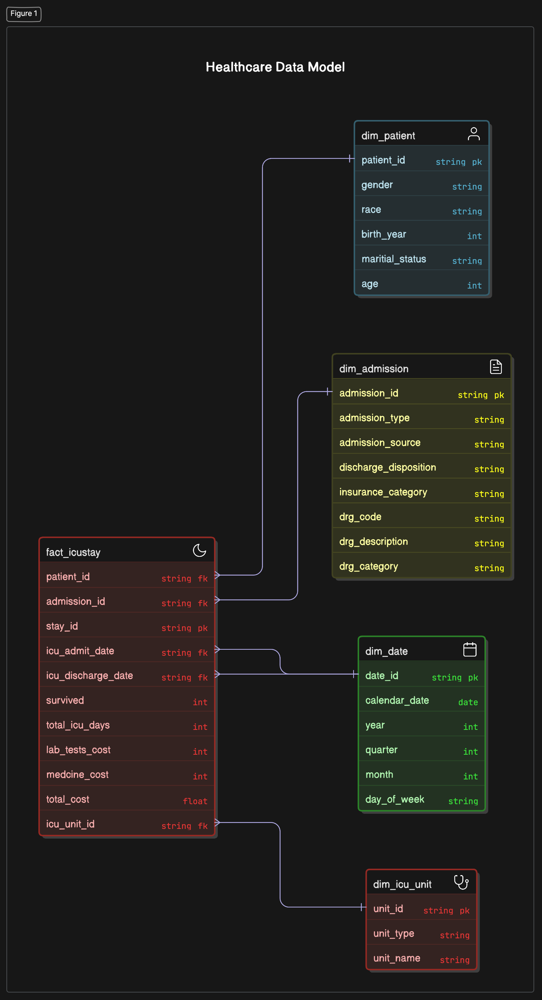

# Data Warehouse for MIMIC-IV medical database cost analysis
This project has the necessary schema design for a data warehouse using the MIMIC-IV medical data for cost analysis.

## Steps to run the project locally for development
This project uses AWS Glue to run the ETL jobs. You can run the Glue jobs locally using Docker. Make sure you have Docker 
installed on your machine.

The below command will run the Glue job that will extract the data from the MIMIC-IV data stored in s3 
and creates a parquet file to filter and select the necessary fields for the fact table and dimension tables as per design.
```bash
docker run -it --rm  -v ~/.aws:/home/hadoop/.aws \
  -v /Users/hiruzen/Programming/Projects/mimic-iv-datawarehouse:/home/hadoop/workspace/ \
  -e AWS_PROFILE=default \
  --name cost public.ecr.aws/glue/aws-glue-libs:5 \
  spark-submit /home/hadoop/workspace/glue/simple_cost_analysis_elt.py --JOB_NAME MIMIC_COST_ANALYSYS
```

The below Glue job will run the ETL job to load the data from the parquet files created in the previous step to the Redshift cluster.

```bash
docker run -it --rm  -v ~/.aws:/home/hadoop/.aws \
 -v /Users/hiruzen/Programming/Projects/mimic-iv-datawarehouse:/home/hadoop/workspace/ \
 -e AWS_PROFILE=default \
 --name cost public.ecr.aws/glue/aws-glue-libs:5 \
 spark-submit /home/hadoop/workspace/glue/redshift_ingestor.py --JOB_NAME MIMIC_INGESTION
```
The Glue job above requires a Glue connection to be created and a s3 endpoint created in the VPC where the Redshift cluster/serverless is located.
```bash
aws glue create-connection --connection-input '{
  "Name": "redshift-connection",
  "ConnectionType": "JDBC",
  "ConnectionProperties": {
    "JDBC_CONNECTION_URL": "jdbc:redshift-serverless://<workgroup>.<aws-account-number>.<aws-region>.redshift-serverless.amazonaws.com:5439/dev",
    "USERNAME": "xxxxxxxxx",
    "PASSWORD": "xxxxxxxxx"
  },
  "PhysicalConnectionRequirements": {
    "SubnetId": "subnet-xxxxxxxxx",
    "SecurityGroupIdList": ["sg-xxxxxxxxx"],
    "AvailabilityZone": "aws-region-availability-zone",
  }
}'
```
Remember to configure your AWS credentials in `~/.aws` directory. You can use the following command to configure your AWS credentials:
```bash
aws configure
```
Get your AWS credentials from the AWS console. You should create a new IAM user with the following permissions
- AmazonS3FullAccess: To allow Glue to read source data from S3 and write the output files.
- AWSGlueServiceRole: This role is assumed by the Glue job to access required AWS services. It should include permissions to run Glue jobs.
- AWSGlueConsoleFullAccess: For full access to the Glue console (if you’re managing jobs interactively).
- AmazonRedshiftFullAccess (or RedshiftFullAccess): To permit operations on Redshift, such as creating clusters, loading data via the COPY command, and running queries.
- AWSKeyManagementServicePowerUser : This policy allows Glue to use KMS keys for encryption and decryption.
- SecretsManagerReadWrite : AWS Secrets Manager is used to store database credentials, this policy allows Glue to read/write secrets.

When your Glue job is submitted, it will assume the specified Glue service role which should have these policies attached. This setup lets the job read from S3 and push data to Redshift without additional permissions.

However, keep these points in mind:
- Create a Redshift cluster or serverless instance in the same VPC as your Glue job to ensure network connectivity.
- Validate that your S3 bucket policies and Redshift cluster security groups (or VPC settings) allow access from your Glue job.
- To create a Glue connection a s3 endpoint should be created in the VPC where the Redshift cluster/serverless is located. This is required to allow Glue to access the S3 bucket.

## Workflow Diagram
</img>

## Data Warehouse Design
</img>
